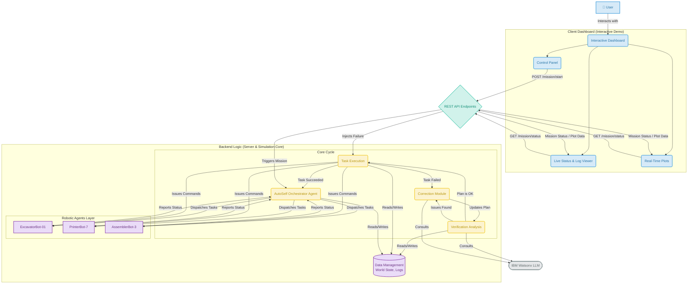
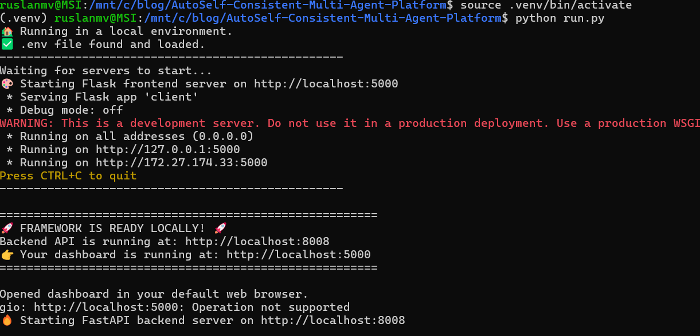
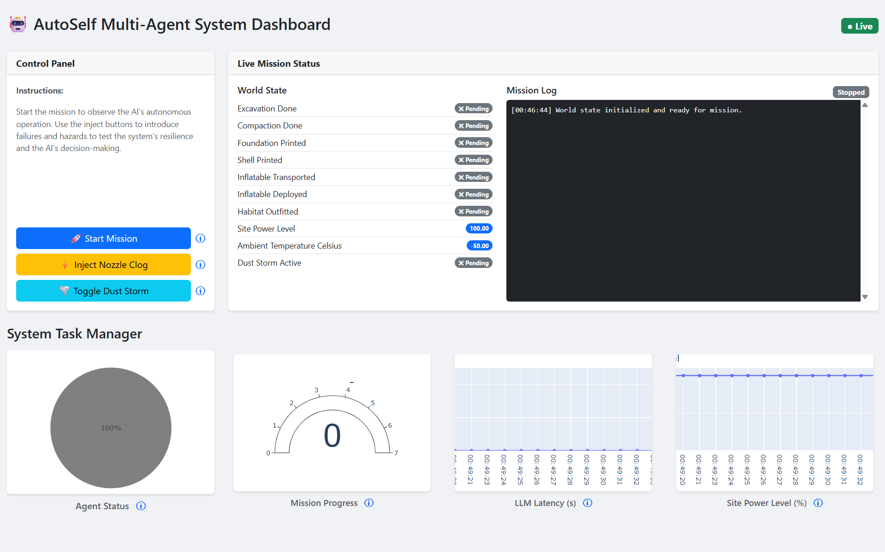
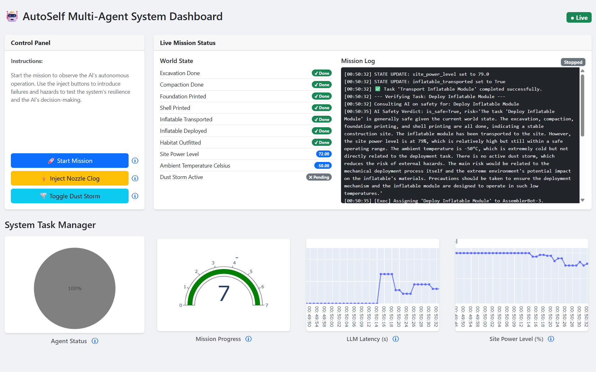
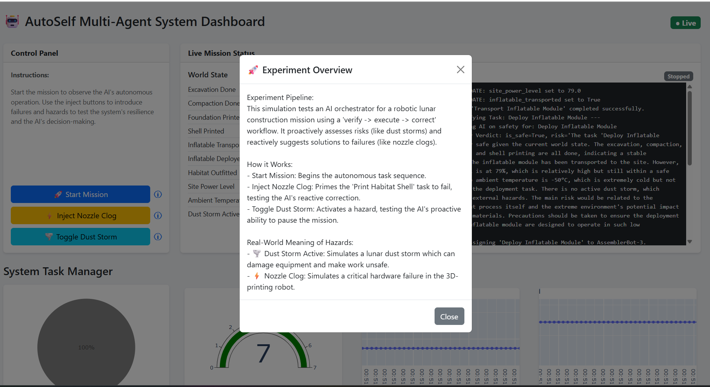
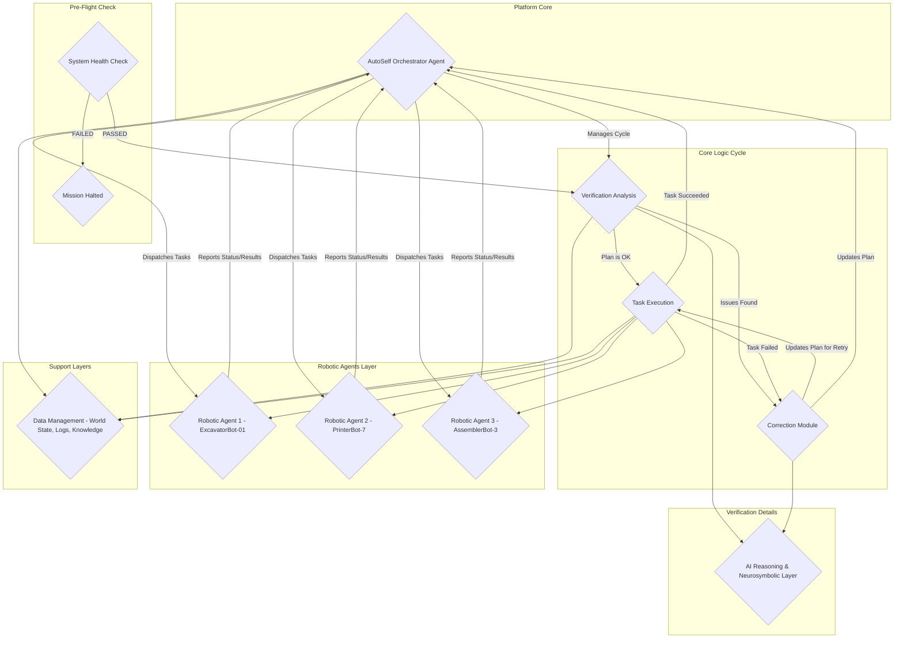

# AutoSelf Consistent Multi-Agent System: Simulation and Demonstration Platform

This repository provides a comprehensive platform for validating and demonstrating the **AutoSelf Consistent Multi-Agent System**. It contains two primary components:

1. A **Simulation Suite** of Python scripts (`first_experiment.py`, `second_experiment.py`) for rigorously testing the architecture's performance and resilience under various conditions.
2. An **Interactive Web Demo** that provides a real-time, visual interface for observing the AutoSelf orchestrator in action and injecting live events.

The core of the project is showcasing the system's ability to handle unpredictable events by leveraging a Large Language Model (LLM) for intelligent decision-making, dynamic re‑planning, and self‑correction.

---

## Why this matters

The accompanying paper introduces the theoretical framework for the AutoSelf system—a novel architecture designed to ensure reliability and safety in autonomous multi‑robot operations. This platform is the practical proof‑of‑concept.

It validates AutoSelf by:

* **Implementing the Core Loop** — a concrete **Execution → Verification → Correction (E–V–C)** cycle.
* **Demonstrating AI Integration** — the orchestrator consults IBM Watsonx for structured reasoning.
* **Illustrating Robustness** — hazards, failures, and contention scenarios are exercised end‑to‑end.

> If the paper answers *what* AutoSelf is, this repo shows *how* it behaves under realistic, unpredictable conditions.

---

## System Architecture

The simulation and demo both implement a central **Orchestrator Agent** that manages simulated robotic agents through the E–V–C cycle.



---

## Repository structure

* **`server.py`** — FastAPI backend running the AutoSelf orchestrator and mission simulation.
* **`client.py`** — Flask dashboard (HTMX + Plotly) for live monitoring and controls.
* **`run.py`** — One‑shot runner that starts both backend and frontend (with optional ngrok in Colab).
* **`first_experiment.py`** — Hazards/Failures E–V–C workflow, emits timelines and summary CSVs.
* **`second_experiment.py`** — Resource contention benchmark with ablations and overhead metrics.
* **`configs/*.yml`** — Orchestrator/world/baseline knobs.
* **`seeds.yaml`** — Deterministic seed sets per experiment.
* **`results/`** — Standardized CSV outputs.
* **`figs/`** — Generated figures for the paper (git‑ignored).

---

## Quickstart (Demo)

### 1) Set API keys

In Google Colab, add these Secrets (🔑):

* `WATSONX_API_KEY`
* `PROJECT_ID` (Watsonx Project ID)
* `WATSONX_URL`
* `NGROK_AUTHTOKEN`

Or locally, create a `.env` file with the same keys.

### 2) Install dependencies

```bash
pip install -r requirements.txt
```

### 3) Run the application

```bash
python run.py
```



Running `run.py` starts both the **FastAPI** backend and the **Flask** frontend. In Colab it exposes public tunnels; locally it opens your browser.



### Using the dashboard

* **Start Mission** — kicks off the lunar construction mission.
* **Inject Nozzle Clog** — forces a one‑shot failure on *Print Habitat Shell*; AutoSelf should retry and/or correct.
* **Toggle Dust Storm** — toggles `dust_storm_active` in `WorldState`; AutoSelf pauses or substitutes safe tasks and resumes.
* **Live Plots** — show agent states, mission progress, LLM latency, and site power.



Supported actions:

* **⚡ Nozzle Clog (Mechanical Failure)** — simulates a 3D‑printer failure; triggers reactive correction.
* **🌪️ Dust Storm (Environmental Hazard)** — simulates a hazard; triggers proactive verification, substitution, or bounded backoff.



---

## Quickstart (Experiments)

Run the fully scripted reproduction (both experiments, all seeds/p‑values):

```bash
make reproduce
```

This produces, at minimum:

* `results/makespan.csv`, `results/conflicts.csv`, `results/throughput.csv`, `results/overhead.csv`, `results/ablations.csv`
* `results/timeline_nominal.csv`, `results/timeline_hazard.csv`, `results/timeline_failure.csv`
* `figs/throughput_plot.pdf`, `figs/Nominal_Mission_timeline.png`, `figs/Dust_Storm_Hazard_timeline.png`, `figs/Nozzle_Clog_Failure_timeline.png`

---

## Notebook demo

**AutoSelf Consistent Multi‑Agent System: Single Demo** — [AutoSelf\_Consistent\_Multi\_Agent\_System.ipynb](AutoSelf_Consistent_Multi_Agent_System.ipynb)

This Colab‑ready notebook reproduces all reported artifacts (CSVs, figures, LaTeX macros) in a single place.



For more information, see [`demo/README.md`](demo/README.md).
