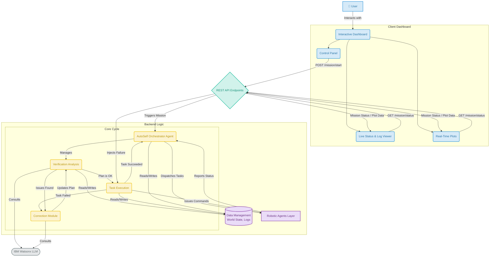

This is the architecture of the app

```mermaid
graph TD
    %% Style Definitions for different node types
    classDef client fill:#D6EAF8,stroke:#3498DB,stroke-width:2px,color:#2874A6
    classDef api fill:#D1F2EB,stroke:#1ABC9C,stroke-width:2px,color:#148F77
    classDef core fill:#FCF3CF,stroke:#F1C40F,stroke-width:2px,color:#B7950B
    classDef support fill:#EADCF8,stroke:#8E44AD,stroke-width:2px,color:#6C3483
    classDef external fill:#E5E7E9,stroke:#839192,stroke-width:2px,color:#616A6B

    %% Client Side
    User[👤 User]
    
    subgraph Client Dashboard
        direction LR
        DashboardUI(Interactive Dashboard)
        ControlPanel(Control Panel)
        LiveStatus(Live Status & Log Viewer)
        Plots(Real-Time Plots)
    end

    %% API Gateway
    APIEndpoints{REST API Endpoints}

    %% Backend Systems
    subgraph Backend Logic
        Orchestrator(AutoSelf Orchestrator Agent)
        subgraph Core Cycle
            direction LR
            Verification(Verification Analysis) -->|Plan is OK| Execution(Task Execution)
            Execution -->|Task Succeeded| Orchestrator
            Execution -->|Task Failed| Correction(Correction Module)
            Verification -->|Issues Found| Correction
            Correction -->|Updates Plan| Verification
        end
        DataManagement[(Data Management <br/> World State, Logs)]
        RoboticAgentsLayer[Robotic Agents Layer]
    end

    %% External Services
    WatsonxLLM([IBM Watsonx LLM])

    %% --- Connections ---

    %% User to Client
    User -- Interacts with --> DashboardUI
    DashboardUI --> ControlPanel & LiveStatus & Plots

    %% Client to API
    ControlPanel -- POST /mission/start --> APIEndpoints
    LiveStatus & Plots -- GET /mission/status --> APIEndpoints
    
    %% API to Backend
    APIEndpoints -- Mission Status / Plot Data --> LiveStatus & Plots
    APIEndpoints -- Triggers Mission --> Orchestrator
    APIEndpoints -- Injects Failure --> Execution

    %% Backend Core Interactions
    Orchestrator -- Manages --> Verification
    Orchestrator -- Dispatches Tasks --> RoboticAgentsLayer
    RoboticAgentsLayer -- Reports Status --> Orchestrator
    Execution -- Issues Commands --> RoboticAgentsLayer
    
    %% Data and External Service Interactions
    Verification & Execution & Orchestrator -- Reads/Writes --> DataManagement
    Verification & Correction -- Consults --> WatsonxLLM

    %% Apply Styles to Nodes
    class User,DashboardUI,ControlPanel,LiveStatus,Plots client
    class APIEndpoints api
    class Orchestrator,Verification,Execution,Correction core
    class RoboticAgentsLayer,DataManagement support
    class WatsonxLLM external
```
