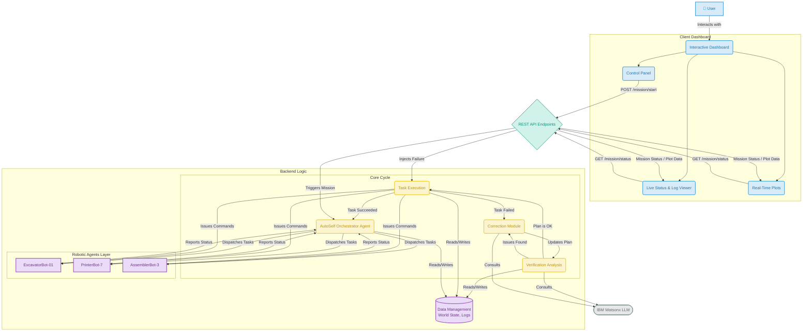

# AI-Powered Autonomous Orchestrator: Simulation Reference

This document serves as a reference for the experimental simulation of an AI-powered autonomous orchestrator for a robotic lunar habitat construction mission.

---

## 1. Experiment Overview 📝

The primary goal of this experiment is to **evaluate the decision-making capabilities of a Large Language Model (LLM) in a dynamic and unpredictable environment**. We simulate a multi-agent robotic system tasked with constructing a lunar habitat, where the central AI orchestrator must supervise, adapt, and correct the mission plan in real-time.

The simulation aims to measure and observe the AI's performance in two key areas:

1.  **Proactive Risk Assessment**: The AI's ability to analyze the current state of the environment (`WorldState`) before executing a task and decide if it's safe to proceed.
2.  **Reactive Failure Correction**: The AI's ability to analyze a task failure, understand the context, and suggest a logical corrective action (e.g., `retry`, `abort`).

---

## 2. Simulation Architecture 🏗️

The system is composed of two main parts: the **Simulation Server** (backend) and the **Control Dashboard** (frontend).

### 2.1. Simulation Server (`server.py`)

This is the core of the experiment, responsible for managing the simulation's logic and state.

* **World State**: A singleton class that tracks all environmental and mission-critical variables. This includes task completion status (`excavation_done`, `shell_printed`), environmental conditions (`dust_storm_active`), and resources (`site_power_level`).
* **Robotic Agents**: A set of simulated agents, each with specific **capabilities** (`excavation`, `printing`, etc.) and a **status** (`idle`, `executing`).
* **Mission Plan**: A predefined, ordered list of tasks required to complete the habitat construction.
* **AutoSelfOrchestrator**: The "brain" of the operation. This class uses an LLM (Watsonx `llama-3-8b-instruct`) to run a `verify -> execute -> correct` workflow for each task in the mission plan.

### 2.2. Control Dashboard (`client.py`)

The dashboard provides a real-time user interface to monitor and interact with the simulation. It allows us to observe the AI's behavior and the mission's progress without directly interfering with the code.

### 2.3. Architecture Diagram

The following diagram illustrates the flow of information between the user, the dashboard, the backend services, and the external LLM.

---

## 3. How to Run the Experiment & Interpret Results 📊

The experiment is initiated and observed through the web-based Control Dashboard.

### 3.1. Starting and Monitoring the Mission

1.  **Start Mission**: Click this button to begin the simulation. The orchestrator will begin processing the first task in the mission plan.
2.  **Mission Log**: This provides a real-time, timestamped feed of all major events, including state changes, AI consultations, and agent actions. **This is the primary source for qualitative analysis of the AI's decisions.**
3.  **World State**: A JSON view of the current environmental and mission variables. Observe how this state changes as agents complete tasks.
4.  **Agent Status**: A pie chart showing the real-time status of all robotic agents.
5.  **Mission Progress**: A gauge indicating the number of completed tasks out of the total.
6.  **LLM API Health & Power Level**: Time-series charts that monitor the latency of calls to the AI model and the overall site power consumption.

### 3.2. Injecting Faults and Hazards

The key to this experiment is to challenge the AI. The dashboard provides controls to introduce unexpected events:

* **Inject Failure**: This button simulates a critical failure on a specific task (e.g., `Print Habitat Shell`).
    * **Expected AI Response**: When the task fails, the `_step_correct` workflow is triggered. The mission log will show the AI being consulted. The expected outcome is a JSON object with a `suggested_action` (e.g., "retry" or "abort") and `reasoning`. This tests the AI's reactive problem-solving.
* **Toggle Hazard**: This button activates or deactivates the `dust_storm_active` environmental hazard.
    * **Expected AI Response**: When the dust storm is active, the `_step_verify` workflow should detect the hazard. The mission log will show the AI identifying the risk and pausing operations. The AI is expected to output a `VerificationResult` with `is_safe: false`. This tests the AI's proactive risk assessment.

### 🌪️ Dust Storm Active

This represents an **environmental hazard**. It's designed to test the AI's **proactive risk assessment**.

* **Real-World Meaning:** It simulates a lunar dust storm. These storms are dangerous because they can block sunlight for solar-powered robots, damage sensitive equipment, and reduce visibility to zero, making it unsafe to operate.
* **How it Works in the Simulation:**
    1.  When you click the **"Toggle Dust Storm"** button, the `dust_storm_active` flag in the `WorldState` is set to `True`.
    2.  Before starting any new task, the orchestrator's first step is to `verify` the conditions.
    3.  The AI is presented with the current `WorldState`, which includes `"dust_storm_active": True`.
    4.  The AI should analyze this, recognize the danger, and respond with `is_safe: false`.
* **Purpose:** To see if the AI is smart enough to check the "weather" before sending a robot out to work. It tests the AI's ability to avoid a problem before it happens.

---

### ⚡ Nozzle Clog

This represents a **mechanical failure**. It's designed to test the AI's **reactive failure correction**.

* **Real-World Meaning:** It simulates a critical hardware failure on the 3D-printing robot. The nozzle is the part that extrudes the building material, so a clog means the robot cannot print the habitat's foundation or shell.
* **How it Works in the Simulation:**
    1.  When you click the **"Inject Nozzle Clog"** button, the system flags the "Print Habitat Shell" task for a guaranteed failure.
    2.  When the orchestrator attempts to `execute` this task, the simulation reports that it failed.
    3.  This failure triggers the `correct` step in the workflow. The AI is informed that the task failed due to a "nozzle clog".
    4.  The AI must then analyze this failure and suggest a logical next step, such as `"retry"` the task (assuming the clog might be temporary) or `"abort"` if the failure is critical.
* **Purpose:** To see how the AI responds *after* something has already gone wrong. It tests the AI's ability to problem-solve and suggest a reasonable solution to recover from a failure.

### 3.3. Key Metrics for Evaluation

When analyzing the results, focus on the following from the dashboard's output:

* **Decision Quality**: Does the AI's `reasoning` for its safety assessments and corrective actions align with a logical understanding of the situation?
* **Response Time (Latency)**: How quickly does the LLM provide a decision? The "LLM API Health" chart tracks this. High latency could be problematic in real-world scenarios.
* **Mission Resilience**: Does the AI's intervention allow the mission to recover from transient failures, or does it correctly identify situations where halting the mission is the safest option?
* **System Stability**: How does the overall system (power, agent status) react to the AI's decisions during normal and failure-injected scenarios?